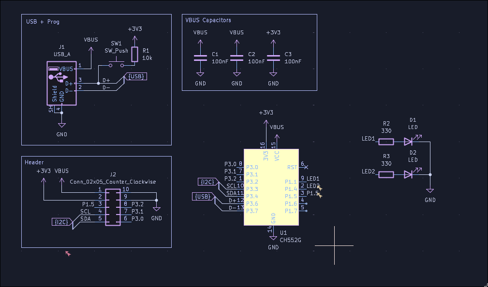
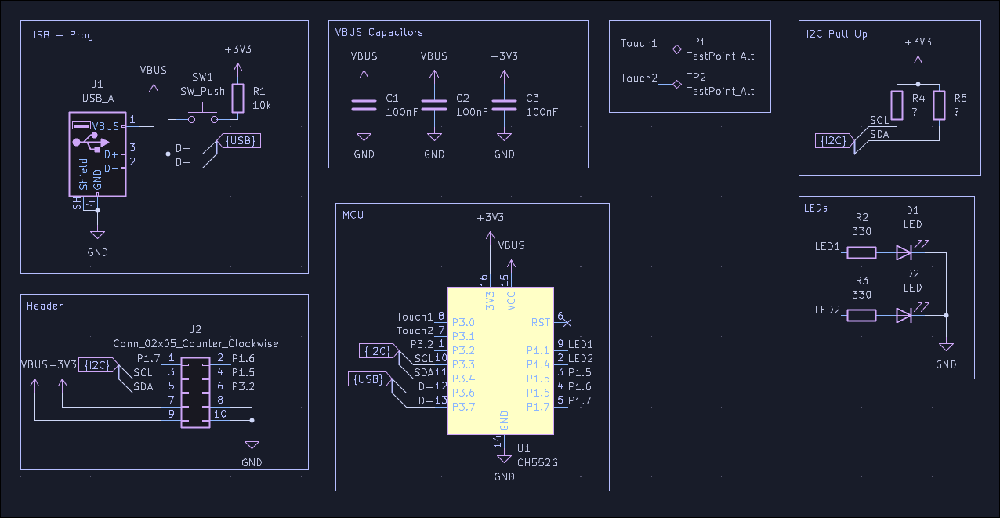
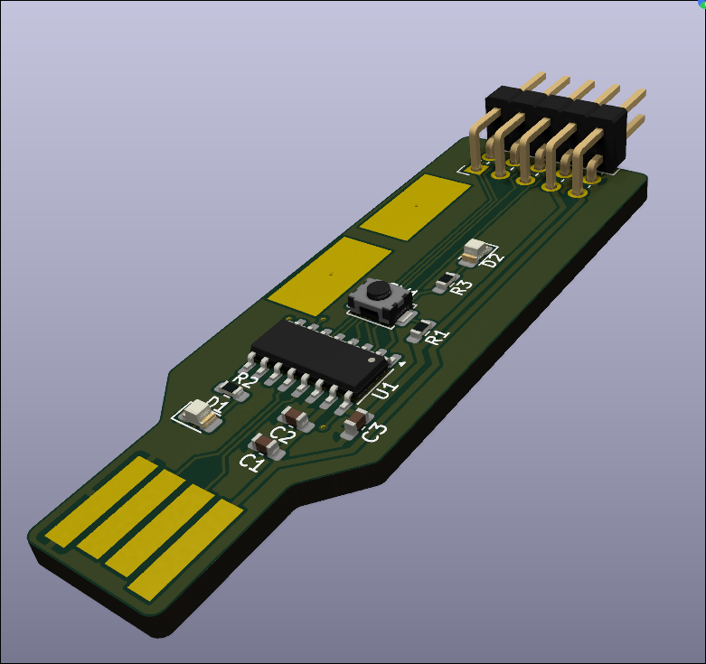

# Mini USB Devboard

A little CH552G USB Devboard, for quickly testing ideas.

Total hours: 2h

## 26/08/2026: Made the Schematic

Time Spent: 2h
Made the schematic for the board. The guide on the ysws was really helpful.
Still not sure what to do with the two leftover pins. Might just add more LEDs.
I tried out the bus feature in KiCad, it definitely helps once you have more than of bus in the project.
Definitely need to add pads for I2C pull-up resistors.

## 26/08/2026: Finished the PCB

Time Spent: 2h
Added some finishing touches to the schematic ( and the I2C stuff)

Also made the PCB, using it as the USB connector.

It has 2 LEDs on it, as well as two touch pads for inputs
All the other pins are available on the header with a nice cheat sheet on the underside.
