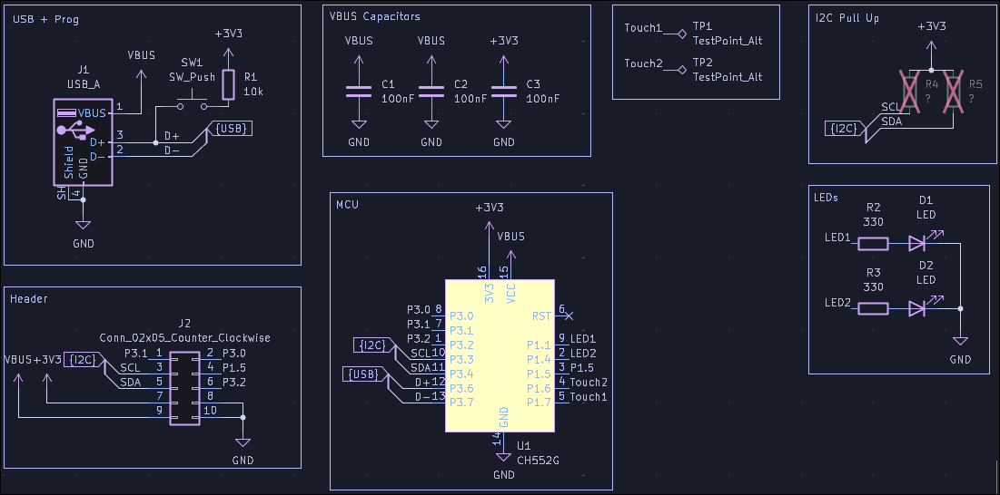
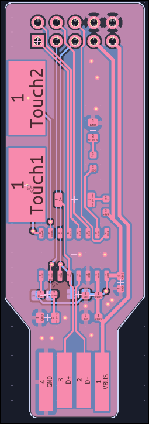
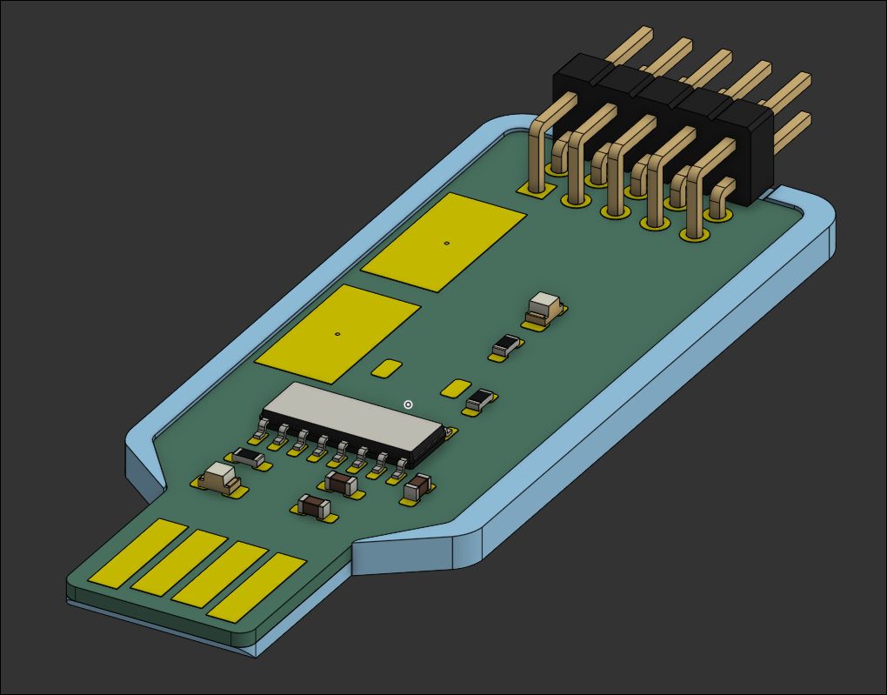

# Mini USB Devboard

<!--toc:start-->
- [Mini USB Devboard](#mini-usb-devboard)
  - [Features](#features)
  - [Schematic](#schematic)
  - [PCB](#pcb)
  - [Case](#case)
  - [Firmware](#firmware)
  - [BOM](#bom)
<!--toc:end-->

A little CH552G USB devboard, for quickly testing ideas.

## Features

- 2 touch pads
- 2 LEDs
- pinouts for connecting external modules
- pads for I2C pullup resistors

## Schematic

## PCB

The PCB itself is the USB jack.

## Case
 
The PCB is press fit into the case, which adds the necessary thickness for the USB jack.

## Firmware

The included firmware blinks one led, and toggles the other one with the touchpad closer to the USB jack.

## BOM

| Name | Qnt | Link | Price |
|-------|-----------|----------   |---------|
|PCB | 5 | jlcpcb.com | 18.70 USD (PCB) + 1.50 USD (Shipping) + 8.92 USD (Taxes) = 29.12 USD |
| OF-SMD2012R Red LED | 2 | [https://www.tme.eu/pl/details/of-smd2012r/diody-led-smd-kolorowe/optoflash/] | 2.78 PLN |
| TSW-105-08-F-D-RA Pins | 1 | [https://www.tme.eu/pl/details/tsw-105-08-f-d-ra/listwy-i-gniazda-kolkowe/samtec/] | 3.96 PLN |
| CH552G | 1 | [https://pl.aliexpress.com/item/1005006904524984.html] | 34.93 (item + taxes) PLN |
| CL10B104KO8NNNL 100nF cap | 3 | [https://www.tme.eu/pl/details/cl10b104ko8nnnl/kondensatory-mlcc-smd/samsung/] | 0.91 PLN |
| WR06X3300FTL 330 Ohm Resistor | 2 | [https://www.tme.eu/pl/details/wr06x3300ftl/rezystory-smd/walsin/] | 0.47 PLN |
| WR06X103JTL 10k Resistor | 1 | [https://www.tme.eu/pl/details/wr06x103jtl/rezystory-smd/walsin/wr06x103-jtl/] | 0.69 PLN |
| TS-1088-AR02016 Switch | 1 | [https://pl.aliexpress.com/item/1005011940516004.html] | 21.31 (item+ taxes) PLN |
| TME Delivery | 1 | - | 17.10 PLN |

Total PLN price: 25.91 (TME) + 34.93 + 21.31 = 82.15 PLN ≈ 23 USD
Total USD: 52.12
